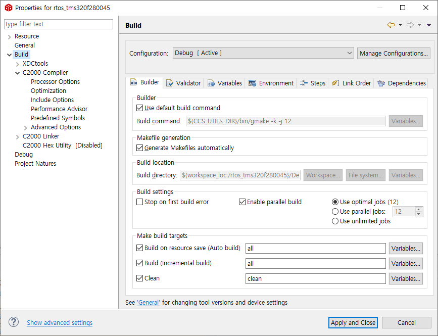

# rtos_tms32f280045
> Using RTOS Kernel (SYS/BIOS)

<!-- [![Build Status][travis-image]][travis-url] -->

## IDE, Library Install URL
Windows : 
[IDE][ccs9_3-download], 
[Library][c2000ware-url],
[RTOS][rtos-download]

Compiler version : TI v20.2.1.LTS

Compiled in CCS v9.3.0, SYS/BIOS v6.83.00.18

## 사용 예제
 ti\ ..\ bios_6_76_04_02\resources\tiTargetExamples\28xSpecificExamples 중 원하는 프로젝트를 Import

_더 많은 예제와 사용법은 [Resource Explorer][resource-explorer]를 참고하세요._

## 개발 환경 설정

Windows 10 개발환경의 `CCS 9.3.0`에서 `build, compile`

### Linker command file 및 Compiler version setting 방법

Processor에 맞춰 선택 (`General > Project > Tool-chain > Linker command file`)

사용하는 Compiler version 선택 (`General > Project > Tool-chain > Compiler version`)

### Build command setting  방법

개발 PC CPU의 논리프로세서 개수 만큼 -j 뒤에 기입해주면 됨 `Build > Builder > Build Command`
> ${CCS_UTILS_DIR}/bin/gmake -k `-j 12`

## 업데이트 내역

* 0.0.1
    * 수정: 문서 업데이트

<!-- Markdown link & img dfn's -->
[c2000ware-url]: https://www.ti.com/tool/C2000WARE
[ccs9_3-download]: https://software-dl.ti.com/ccs/esd/documents/ccs_downloads.html#code-composer-studio-version-9-downloads
[rtos-download]: https://software-dl.ti.com/dsps/dsps_public_sw/sdo_sb/targetcontent/bios/sysbios/index.html
[travis-image]: https://img.shields.io/travis/tlals96/f280045_DMA_ADC/master.svg?style=flat-square
[travis-url]: https://app.travis-ci.com/github/tlals96/f280045_DMA_ADC
[resource-explorer]: https://dev.ti.com/tirex/explore/node?compilers=ccs&devices=F280045&node=AL.a.macE.c7rSiGSB7klQ__gYkahfz__LATEST
[general-setting]: https://https://img.shields.io/travis/tlals96/f280045_DMA_ADC/images/ccs_general_setting.png?retina